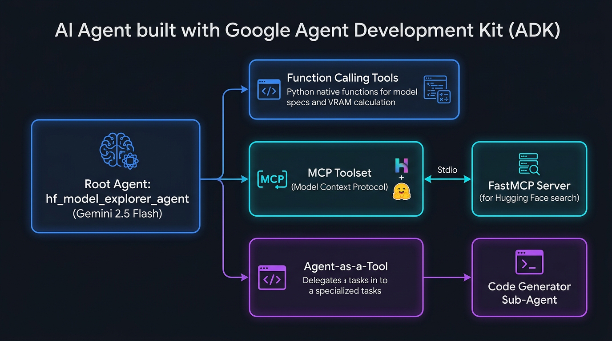

# ECI 2026 - Clase 2: Herramientas (Tools) y Model Context Protocol (MCP)

Bienvenido a la **Clase 2** del curso *"Construyendo Agentes de Inteligencia Artificial"* de la **Escuela de Ciencias Informáticas (ECI 2026 - UBA)**.

En esta clase exploramos cómo extender las capacidades de los modelos de lenguaje mediante el uso de **Herramientas (Tools)** y el estándar abierto **Model Context Protocol (MCP)** desarrollado por Anthropic y adoptado ampliamente en la industria.

---

## 🎯 Objetivos de la Clase

1. **Llamadas a Funciones (Function Calling)**: Integración de funciones nativas en Python para consulta de datos estructurados y cálculos.
2. **Model Context Protocol (MCP)**: Conexión mediante `McpToolset` a un servidor MCP independiente para descubrimiento dinámico de herramientas y recursos.
3. **Agente como Herramienta (Agent as a Tool)**: Envoltorio de sub-agentes especializados utilizando `AgentTool` para la delegación modular de tareas (ej: generación de código).

---

## 🤖 El Agente: Explorador de Modelos LLM / Hugging Face (`hf_model_explorer_agent`)

Para aplicar estos conceptos de manera práctica, hemos desarrollado un agente educativo que ayuda a consultar y comparar los modelos de IA más populares del ecosistema (Open Source y Propietarios):

* 🟢 **Gemma 3 & Gemma 2** (Google DeepMind)
* 🦙 **Llama 3.3 & Llama 3.1** (Meta AI)
* 🧠 **DeepSeek R1 & V3** (DeepSeek AI)
* 💻 **Qwen 2.5 Coder** (Qwen / Alibaba)
* 💎 **Gemini 2.5 & Gemini 3** (Google DeepMind)
* 🟧 **Claude 3.7 & 3.5** (Anthropic)

---

## 🖼️ Diagrama de Arquitectura del Agente



---

## 🏗️ Arquitectura del Proyecto

```
clase-2/
├── README.md                          # Este archivo de documentación
├── requirements.txt                   # Archivo de dependencias (google-adk, mcp, etc.)
├── arquitectura_agente.png            # Diagrama de arquitectura del agente (PNG)
└── hf_model_explorer_agent/           # Módulo del agente Google ADK
    ├── .env                           # Configuración de variables de entorno (API Key)
    ├── agent.py                       # Definición del root_agent e integración de herramientas
    └── tools/
        ├── function_tools.py          # [Tool 1] Llamadas a función nativas de Python
        ├── mcp_server.py              # [Tool 2] Servidor MCP con FastMCP (Stdio)
        └── sub_agents.py              # [Tool 3] Sub-agente de código envuelto en AgentTool
```

---

## 🛠️ Implementación de las Herramientas (Tools)

### 1. Function Calling (`function_tools.py`)
Funciones Python con tipado estático y *docstrings* descriptivos. Google ADK genera automáticamente el esquema JSON Schema para el modelo Gemini.
* `obtener_especificaciones_modelo(nombre_modelo)`: Devuelve parámetros, ventana de contexto, VRAM y licencias.
* `comparar_modelos(modelo_a, modelo_b)`: Compara dos modelos lado a lado.
* `calcular_vram_requerida(parametros_billon, precision_bits)`: Calcula el consumo de memoria GPU para inferencia local.

### 2. Model Context Protocol (`mcp_server.py` + `McpToolset`)
Implementa un servidor MCP independiente utilizando la librería oficial `mcp` (`FastMCP`). El agente principal se conecta a este servidor mediante `McpToolset` sobre transporte **Stdio**.
* `mcp_buscar_modelos_huggingface(query, tarea)`: Filtra repositorios del Hub por tipo de tarea.
* `mcp_obtener_tendencias_hf()`: Retorna los modelos con mayor crecimiento en el Hub.
* `mcp_info_servidor_protocolo()`: Reporta información del canal MCP activo.

### 3. Sub-agente como Herramienta (`sub_agents.py` + `AgentTool`)
El sub-agente `codigo_experto_subagent` está especializado únicamente en escribir snippets de código Python limpios usando `transformers`, `ollama`, `google-genai` o `anthropic`. Se integra al agente principal a través de `AgentTool(agent=codigo_experto_subagent)`.

---

## 📦 Instalación de Dependencias

Antes de ejecutar el agente, instala las librerías necesarias ejecutando desde la raíz del proyecto (`agents/`):
```bash
pip install -r clase-2/requirements.txt
```

---

## 🔑 Configuración

Asegúrate de contar con tu clave de API de Google Gemini en el archivo `.env`:

1. Navega a la carpeta del agente o edita directamente el archivo `.env`:
   ```bash
   cd clase-2/hf_model_explorer_agent
   ```
2. Agrega tu clave en el archivo `.env`:
   ```env
   GOOGLE_GENAI_USE_VERTEXAI=0
   GOOGLE_API_KEY=tu_clave_api_aqui
   ```

---

## 🚀 Cómo Ejecutar el Agente

Puedes interactuar con el agente a través del CLI de Google ADK desde la raíz de la carpeta `agents/`:

### 1. Modo Interactivo en la Terminal (Chat de Texto)
```bash
adk run clase-2/hf_model_explorer_agent
```

### 2. Interfaz Web Interactiva
```bash
adk web clase-2/hf_model_explorer_agent
```
Luego abre tu navegador en `http://localhost:8000`.

### 3. Ejemplos de Consultas para Probar las Herramientas

* 📌 **Probar Function Calling**:
  > *"¿Cuáles son las especificaciones de Gemma 3 27B y cuánta VRAM requiere en INT4?"*

* 📌 **Probar Comparación y VRAM**:
  > *"Compara Llama 3.3 70B con DeepSeek R1 e indica el cálculo de VRAM para 70B a 16 bits."*

* 📌 **Probar Protocolo MCP**:
  > *"Usa el protocolo MCP para obtener las tendencias actuales de Hugging Face."*

* 📌 **Probar Sub-agente de Código (AgentTool)**:
  > *"Dame un ejemplo completo de código Python para hacer inferencia con Gemma 3 27B usando la librería transformers."*
