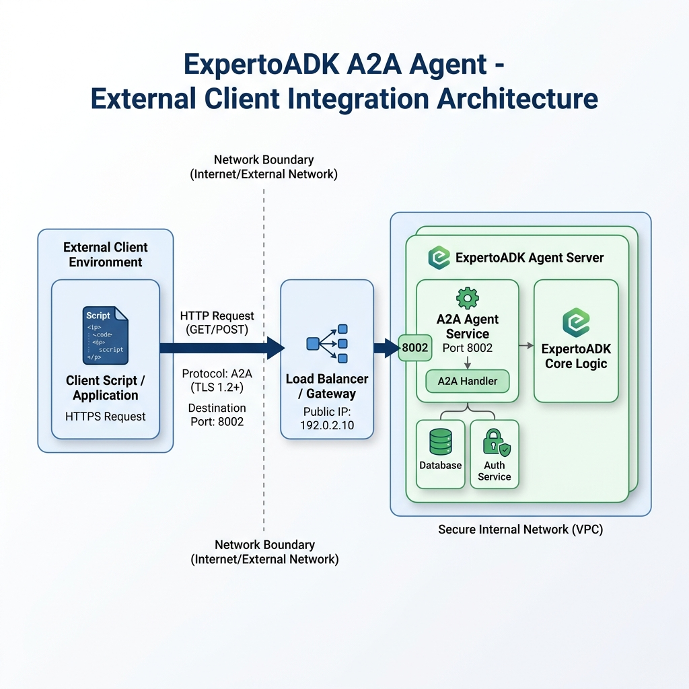

# ECI 2026 - Clase 3: Cliente-Servidor A2A Simple

Bienvenido a la **Clase 3** del curso *"Construyendo Agentes de Inteligencia Artificial"* de la **Escuela de Ciencias Informáticas (ECI 2026 - UBA)**.

---

## 🎯 Objetivos de la Clase

1. **Protocolo Agent-to-Agent (A2A)**: Aprender a exponer de manera sencilla un agente de Google ADK mediante A2A.
2. **Uso de `to_a2a`**: Convertir un agente en una aplicación ASGI/Starlette para servirla mediante un servidor web (`uvicorn`).
3. **Interacción de Agentes**: Consumir programáticamente un agente remoto.

---

## 🤖 El Agente: Experto en Google ADK (`a2a_simple_cliente_servidor`)

El script `demo_simple_to_a2a.py` define un agente que explica qué es Google ADK y cuáles son los patrones principales para construir agentes. Utiliza la función nativa `to_a2a` del SDK para exponer una API A2A. El script `demo_consumir_a2a.py` muestra cómo conectarse y enviarle mensajes.

---

## 🖼️ Diagrama de Arquitectura del Agente



---

## 🏗️ Arquitectura del Proyecto

```text
a2a_simple_cliente_servidor/
├── README.md                      # Documentación del agente de la clase
├── arquitectura_agente.png        # Diagrama explicativo en formato PNG
├── demo_simple_to_a2a.py          # Script principal: Servidor A2A
└── demo_consumir_a2a.py           # Script cliente: Cómo consumir un agente A2A
```

---

## 🛠️ Implementación de las Herramientas (Tools)

Este ejemplo es puramente conversacional y enfocado en la exposición y consumo del protocolo A2A, por lo que no implementa herramientas adicionales complejas.

---

## 📦 Instalación de Dependencias

Ejecuta desde la raíz del directorio:
```bash
pip install -r clases/clase-3/agentes/requirements.txt
```

---

## 🔑 Configuración

Asegúrate de contar con tu clave de API de Gemini configurada. Puedes exportarla como variable de entorno o crear un archivo `.env`:

```env
GOOGLE_API_KEY=tu_clave_api_aqui
```

---

## 🚀 Cómo Ejecutar el Agente

### 1. Iniciar el Agente Servidor

En una terminal, ejecuta:

```bash
python clases/clase-3/agentes/a2a_simple_cliente_servidor/demo_simple_to_a2a.py
```

Al hacerlo, `uvicorn` iniciará un servidor web en el puerto `8002`. Podrás inspeccionar:
- **AgentCard**: `http://127.0.0.1:8002/.well-known/agent.json`
- **Endpoint A2A**: `http://127.0.0.1:8002/a2a/v1/message`

### 2. Consumir el Agente (Cliente)

En otra terminal, corre el script cliente que se conectará al servidor A2A y enviará una consulta:

```bash
python clases/clase-3/agentes/a2a_simple_cliente_servidor/demo_consumir_a2a.py
```

El script descargará la AgentCard pública y luego hará una petición HTTP POST al endpoint de mensajes del agente, mostrando su respuesta por consola.
